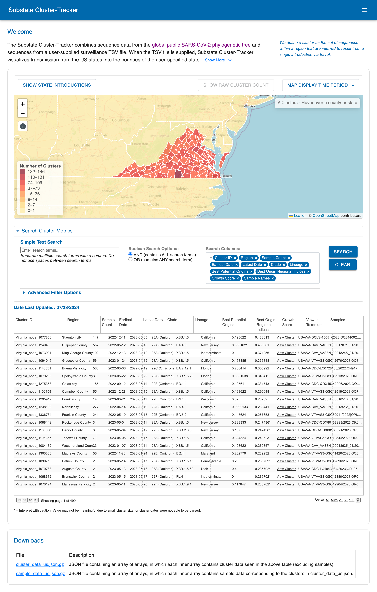

# Substate Cluster-Tracker
The code in this repository is a customized version of https://github.com/pathogen-genomics/introduction-website. The original code in this GitHub repo subdirectory generates a webpage displaying SARS-CoV-2 clusters and introductions inferred via [matUtils introduce](https://usher-wiki.readthedocs.io/en/latest/matUtils.html#introduce). In this version, the browser performs a quick and computationally inexpensive recalculation that enables substate resolution for introductions into the specified state. Once the user has specified their state of interest and supplied the necessary surveillance file [Surveillance File](#surveillance-file), the interactive map will display clusters at the county level, visualizing the spread into the state.

#### Contents

* [Screenshot](#screenshot)
* [Instructions](#instructions)
* [Surveillance File](#surveillance-file)

## Screenshot



## Instructions
1. In order for this customized version of the application to work correctly, first ensure that the code was built with the correct state of interest specified. Within the directory www/recalculateData, there should be a lexicon for your state of interest under the name "county_lexicon.{state_abbreviation}.txt". If this file exists with the correct abbreviation of your state, the code was built correctly.

2. The surveillance file needs to be properly configured. Follow the directions and specifications here[Surveillance File](#surveillance-file). To reiterate, the two-column surveillance TSV, with sample IDs and County FIPS codes, needs to be renamed to "sample_fips.tsv" and placed in the following directory: www/recalculateData

3. After completing steps 1 and 2, you can now view your results with a Python server initiated in the "www" directory. This can be done with the following commands:

```
cd www
python3 -m http.server
```
The website should now be available at http://localhost:8000/

If the map loads and shows the entire US with all states being colored, revisit steps 1 and 2 and try again. If this does not work, clear your browser's cache.

## Surveillance File
For this version to work properly, the user must properly supply a two-column surveillance file in .tsv format. The columns are defined below:

1. Sample ID
2. County FIPS code

The recalculation depends on the provided sample being identified as the introduction sample of the cluster. Therefore, many of the samples in the surveillance file will not affect the recalculation. For the best results, provide a file with many entries. 

For example purposes, there already exists a file "sample_fips.tsv" that consists of fake and randomized data. You are to replace this file with your surveillance TSV file.

Once your file is in the correct format, rename it to "sample_fips.tsv". Afterwards, navigate to the directory www/recalculateData directory and replace the existing "sample_fips.tsv" with your file.


